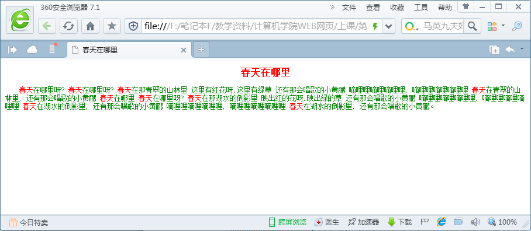
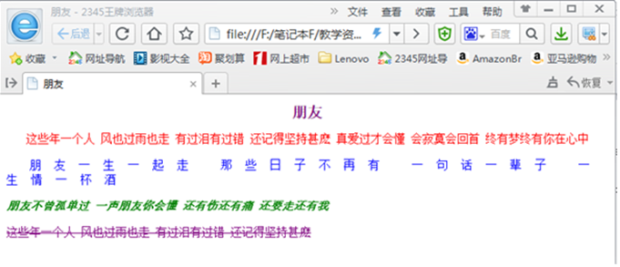

页面1：

1、使用标记选择器控制页面元素。

2、设置所有文本为宋体、12像素、绿色字体，“春天”字体颜色设为红色。

3、设置h2标题“春天在哪里”为16像素、红色、加粗、居中、上划线的效果。

4、设置文本首行缩进2个字符。

春天在哪里呀?

春天在哪里呀?  春天在哪里呀?  春天在那青翠的山林里  这里有红花呀,这里有绿草
还有那会唱歌的小黄鹂
嘀哩哩嘀哩嘀哩哩,
嘀哩哩嘀哩嘀哩哩  春天在青翠的山林里,  还有那会唱歌的小黄鹂  春天在哪里  春天在哪里呀?  春天在那湖水的倒影里  映出红的花呀,映出绿的草
还有那会唱歌的小黄鹂
嘀哩哩嘀哩嘀哩哩,
嘀哩哩嘀哩嘀哩哩  春天在湖水的倒影里,  还有那会唱歌的小黄鹂  嘀哩哩嘀哩嘀哩哩,  嘀哩哩嘀哩嘀哩哩  春天在湖水的倒影里,  还有那会唱歌的小黄鹂。

页面2：

1、综合使用标记选择器、id选择器及类选择器控制元素。

2、设置所有文本为宋体、14像素，行高为18像素。

3、设置h1标题“朋友”为18像素、紫色、加粗、居中的效果。

4、设置第一段文本为红色、居中对齐。

5、设置第二段文本为蓝色、首行缩进2个字符、字间距为16像素。

6、设置第三段文本为绿色、加粗、斜体。

7、设置第四段文本为紫色、删除线效果。

朋友

   这些年一个人 风也过雨也走 有过泪有过错 还记得坚持甚麽
真爱过才会懂 会寂寞会回首 终有梦终有你在心中

  朋友一生一起走 那些日子不再有 一句话一辈子  一生情一杯酒

  朋友不曾孤单过 一声朋友你会懂 还有伤还有痛  还要走还有我

  这些年一个人风也过雨也走有过泪有过错还记得坚持甚麽
